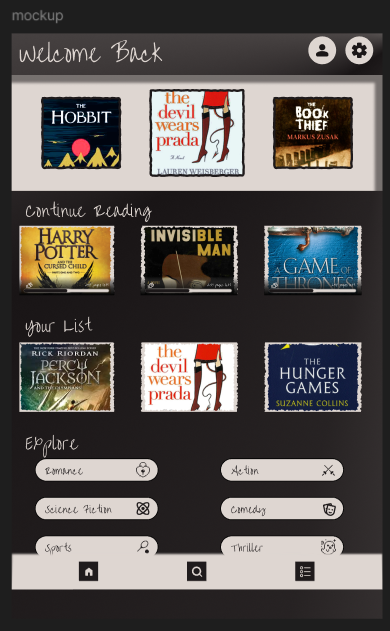
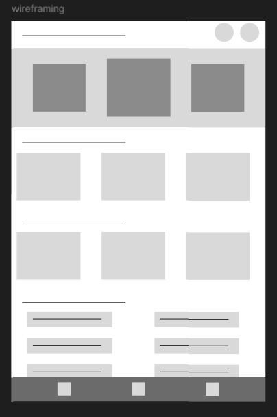

# 📚 Reader App – Homepage UI Concept

A modern and aesthetic **Reader App Homepage UI** designed for book lovers who enjoy a clean and immersive reading experience.

This project showcases the complete UI/UX workflow — from low-fidelity wireframes to polished high-fidelity mockups and reusable component variants.

---

# ✨ Features

- 📖 Continue Reading section
- 📚 Personalized reading recommendations
- 🗂️ User reading lists
- 🔍 Explore genres/categories
- 🌙 Dark themed interface
- 📱 Mobile-first layout
- 🧩 Reusable UI component variants
- 🧭 Minimal bottom navigation

---

# 🎯 Project Goal

The goal of this project was to create:
- A visually engaging reading experience
- Easy and intuitive navigation
- A clean and modern dark-themed interface
- A scalable and reusable UI system

---

# 🛠️ Design Process

## 1. Wireframing
Started with low-fidelity wireframes to define:
- Layout structure
- User flow
- Content hierarchy
- Navigation placement

## 2. High-Fidelity Mockup
Converted the wireframes into polished UI screens with:
- Typography styling
- Visual hierarchy
- Dark aesthetic design
- Interactive UI elements

## 3. Component Variants
Created reusable component variants for:
- Book cards
- Navigation items
- Genre chips
- Layout consistency

This improves scalability and future design iterations.

---

# 🎨 Design Style

- Minimal & modern
- Cozy reading-focused aesthetic
- Dark UI theme
- Clean spacing and hierarchy
- Comfortable visual contrast

---

# 🧰 Tools Used

- Figma
- Auto Layout
- Component Variants
- UI Wireframing
- UX Design Principles

---

# 📱 Screens Included

- Homepage UI
- Continue Reading Section
- Your List Section
- Explore Categories
- Component Variants

---
## 📱 High-Fidelity Mockup

  

---

## 🧩 Wireframe

  

---

## 🎨 Component Variants

  

# 🚀 Future Improvements

- Search functionality
- Reading progress tracking
- Book detail pages
- User profile customization
- AI-based recommendations
- Light/Dark mode switch

---

# 💡 Learning Outcomes

Through this project, I improved my skills in:
- UI hierarchy
- Mobile-first design
- Design systems
- Component scalability
- UX thinking
- Visual consistency

---

# 🤝 Feedback

Feedback and suggestions are always welcome!

If you liked this project:
⭐ Star the repository  
🍴 Fork the project  
📢 Share your thoughts

---

# 📌 Connect With Me

Feel free to connect and share your feedback on the project! ❤️

